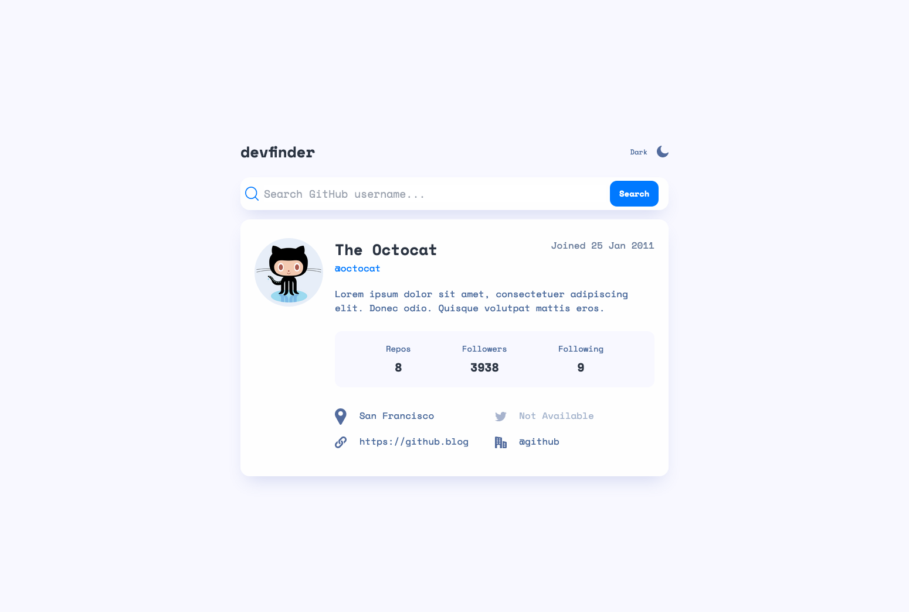
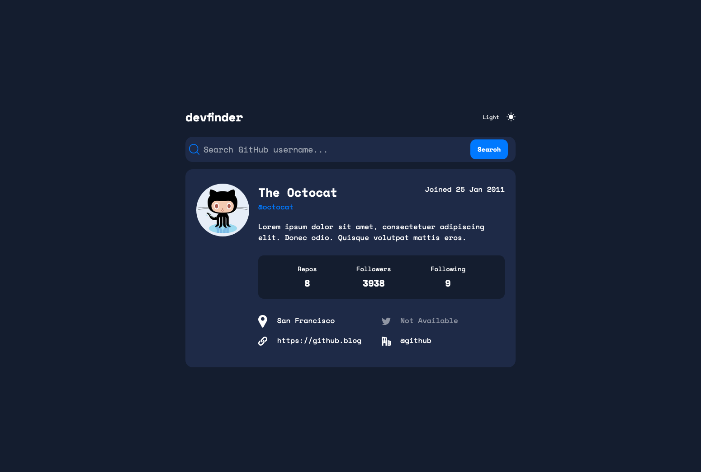

# GitHub User Search

This Github User Search was built based on a design provided by [Frontend Mentor](https://www.frontendmentor.io/challenges/github-user-search-app-Q09YOgaH6). The application is responsive and built with a mobile-first mindset. 

## Overview

### User Story

Users should be able to:

- View the optimal layout for the app depending on their device's screen size
- See hover states for all interactive elements on the page
- Search for GitHub users by their username
- See relevant user information based on their search
- Switch between light and dark themes
- Have the correct color scheme chosen for them based on their computer preferences.

### Screenshots

**Light Mode**

**Dark Mode**

### Live Site
[Github User Search Live Site](https://brookescodestuff.github.io/github-user-search/)

### Built With

- Semantic HTML5 markup
- [TailwindCSS v3.1.6](https://tailwindcss.com/)
- Mobile-first workflow